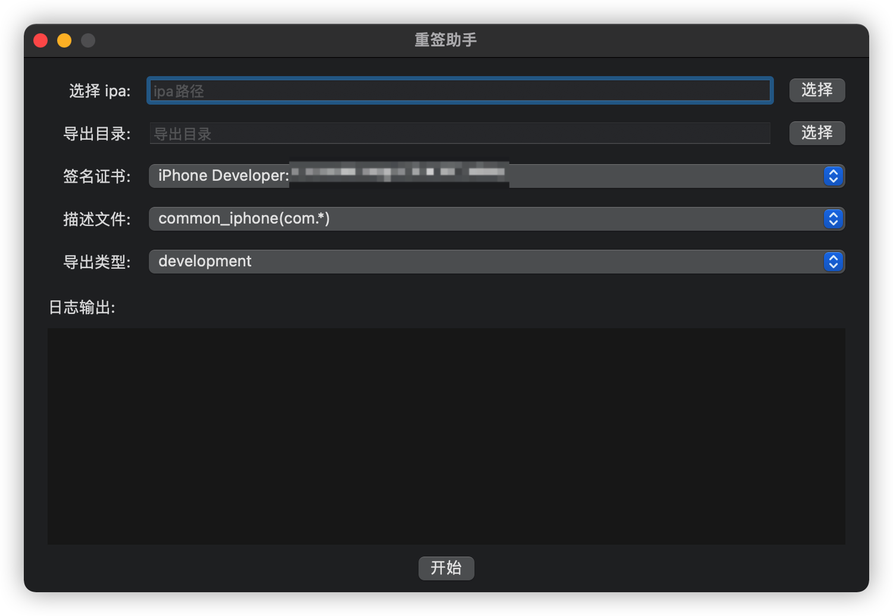
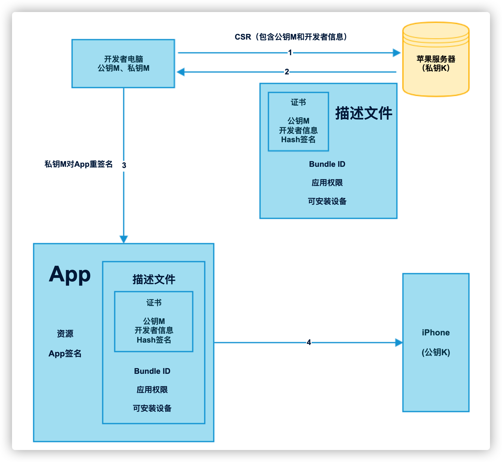
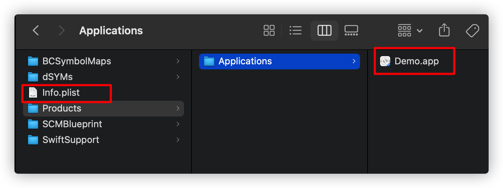
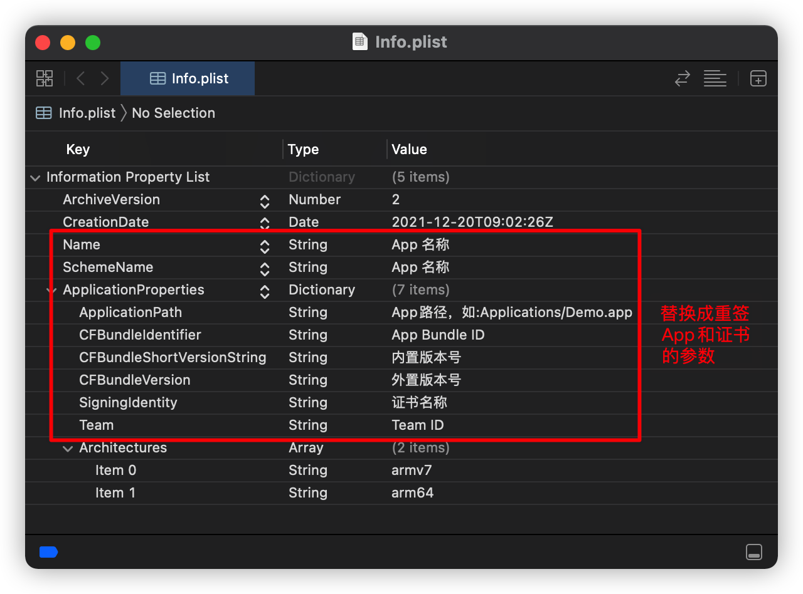
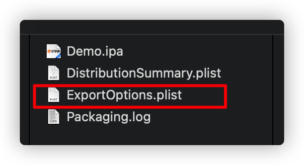
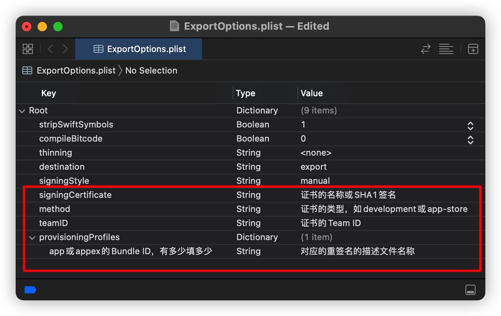

# 教你实现一个 iOS 重签名工具

掘金：[教你实现一个 iOS 重签名工具 - 掘金](https://juejin.cn/post/7049696230309363725/)


## 软件截图



## 一. 前言

对于 iOS 开发者来说，重签名技术应该说是比较熟悉的，而且重签名的实现脚本网上已经有很多，实现逻辑上基本也差不多，其中不乏像 [iOS App Signer](https://github.com/DanTheMan827/ios-app-signer) 这样优秀的重签名工具。


但是，​由于不同的业务场景下，不同证书和不同包体的重签名目的都不一样，很难一个工具满足所有开发者的需求。目前团队的测试流程是对游戏包重签名后，再安装到测试设备上进行测试，在日常的重签打包工作下，发现部分游戏包在重签名后存在一些问题（安装不上，某些权限功能不能用等），而用 Xcode 进行 Archive 操作后在 Xcode Organizer 中导出的包体不会出现异常。所以采用 Xcode 的 `xcodebuild`  命令的 `-exportArchive` 指令来进行重签名，发现重签名的成功率和包体稳定性提高了很多。


## 二. iOS 签名机制

在了解重签名之前，我们先来了解一下 ipa 包的签名机制




> 1. 开发者 Mac 系统中生成一对非对称加密算法的公私钥 M，将公钥和开发者信息生成 CSR 文件给到苹果服务器
> 2. 苹果有自己的公私钥 K，其中公钥 K 存在每一台的 iPhone 设备上，私钥 K 则保存在苹果服务器。根据 CSR 内容利用私钥 K 进行签名并生成证书，同时也根据在开发者后台填写的信息（Bundle ID，权限等）和证书生成描述文件（mobileprovision）
> 3. 在开发者设备上打包时，会把描述文件一并打包到 ipa 中，并利用私钥 M 对包的内容进行签名
> 4. 在安装到设备上时，会进行两次验证：
>    1. 利用设备上的公钥 K 校验 ipa 包内的证书文件（证书是通过苹果私钥 K 签名），校验证书是否有效
>    2. 上一步证书校验通过后，会拿出证书内的公钥 M 来校验 ipa 包（ipa 包是通过开发者私钥 M签名），校验 ipa 包是否可安装


苹果通过以上的双重验证机制，来确保在开发阶段 App 的安装行为的合法性。当将 App 提交到 App Store 后，苹果会对 App 重新加密签名，安装时就只需验证苹果的签名。


## 三. 重签名脚本

重签名的流程大致可以分成以下 5 个步骤，下面列出其中的关键命令：

```shell
#!/bin/sh
set -e

# 这里只列出重签名脚本的大致流程
# 基本可以分为以下 5 个步骤


# 1. 解压游戏包，删除包内无用内容（.DS_Store，__MACOSX等），如需要，修改Info.plist参数和图标等资源
unzip "ipa路径" -d "目标路径"
find -d "解压后的路径" -name .DS_Store -o -name __MACOSX | xargs rm -rf


# 2. 对需要重签的内容并重签名
find -d "包体路径" \
-name "*.app" -o \
-name "*.appex" -o \
-name "*.framework" \
-o -name "*.dylib" \
| xargs -I {} /usr/bin/codesign --continue -f -s "证书名称" {}


# 3. 找出 appex 里面的 bundle id
find -d "包体路径" -name "*.appex" \
| xargs -I {} /usr/libexec/PlistBuddy -c "Print :'CFBundleIdentifier'" {}/Info.plist


# 4. 修改 xcarchive 模板信息
#    复制 .app 文件到 xcarchive 的 Products/Applications 目录下
#    修改 xcarchive 内的 Info.plist 和 ExportOptions.plist 包名，证书名称，描述文件名称等信息


# 5. 导出ipa包
xcodebuild -exportArchive \
-archivePath "xcarchive路径" \
-exportOptionsPlist "ExportOptions.plist路径" \
-exportPath "导出路径"
```


### 1. 解压 ipa 并修改包内容

- 删除包体内无用文件（.DS_Store，__MACOSX 等系统文件）

- 读取并修改 Info.plist 参数（Bundle ID，版本号，应用名称等信息）

- 如需要，可修改包内 icon 等资源文件


### 2. codesign 命令重签名

**这一步与其他的重签脚本有点不一样**，以 iOS App Signer 的逻辑为例，需要先将 `mobileprovision` 复制到包内改名为 `embedded.mobileprovision`，并从中提取 `Entitlements` 相关参数作为 `codesign` 的参数来重签的。

现在的流程是：不需要手动去替换包内的 embedded.mobileprovision 文件，因为后续的 `xcodebuild -exportArchive` 命令执行时会自动完成替换，所以 codesign 命令也是不需要 `--entitlements` 参数的。


### 3. 读取 appex 的 Bundle ID

appex 是什么？appex 其实就是 Plugins 目录下的内容，是 App 的插件（Extension），像 VPN、通知等功能的包就需要插件来实现。一个 appex 其实可以理解为一个小型 App（只是需要依赖 App 才能运行），所以如果有开发过 Extension 功能的同学就会知道，Appex 也是会有独立的证书、描述文件和 Info.plist。所以这一步需要读取所有 Appex 的 Bundle ID，因为后续的签名需要用到。


### 4. 修改 xcarchive 内容

根据最后一步的 `xcodebuild -exportArchive` 命令，我们需要传一个 xcarchive 路径和 `ExportOptions.plist` 路径。（ **xcarchive** 就是我们在 Xcode -> Product -> Archive 的产物。）


xcarchive 路径下的内容：




- **BCSymbolMaps**：符号文件 ，Xcode 对 BitCode 符号表进行混淆（Symbol Hiding）后生成的对照表，和 dSYM 文件会一一对应。
- **dSYMs**：存储此次编译的符号表（debug symbols），用来符号化解析崩溃堆栈。
- **Info.plist**：xcarchive 的信息
- **Products**：存储此次编译生成的的 App 包（.app）。
- **SCMBlueprint**：如果 Xcode 打开了版本管理（Preferences -> Source Control -> Enable Source Control），SCMBlueprint 文件夹会存储此次编译的版本控制信息，包括使用的 git 版本、仓库、分支等。
- **SwiftSupport**：如果你在 Target 的 `Build Settings` 中打开了 `ALWAYS_EMBED_SWIFT_STANDARD_LIBRARIES`，此次编译使用的 Swift 版本对应的标准库文件（.dylib）会被放到这个文件夹中。


首先，我们需要替修改目录下 `Info.plist` 的参数，并且把 `Products/Applications` 下的 app 文件替换为需要重签名的 App。




另一个 `ExportOptions.plist` 文件是我们导出 ipa 包的所需要参数，也是使用 Xcode 导出 ipa 包时的产物之一。



`ExportOptions.plist` 文件内容需要修改以下字段：




### 5. 重签名并导出 ipa

最后，只需要把 xcarchive 目录和 ExportOptions.plis 的内容修改成需要重签名包的内容，就可以利用 `xcodebuild -exportArchive` 命令来重签名和导出包体。


## 四、总结

其实现在网上已经有非常多优秀 iOS 重签名脚本，基本能满足大多数开发者使用。但是如果希望保证重试的成功率，与 Xcode 打包一样准确的话，使用 `xcodebuild -exportArchive` 构建 ipa 包显然是目前最优的解决方案。

以上就是我们内部现在使用的重签脚本的实现思路，为了方便大家了解详细的实现思路，小编也根据这个逻辑写了一个 Mac 版的重签工具，方便学习同时也能直接使用。最后，欢迎大家来使用和提出建议~~

- [37iOS/Easy-Signer: iOS App 的 Mac 重签名工具](https://github.com/37iOS/Easy-Signer)


## 五、参考

* [DanTheMan827/ios-app-signer](https://github.com/DanTheMan827/ios-app-signer)
* [iOS应用安全3 -- APP重签名 - 掘金](https://juejin.cn/post/6844904098030944264#heading-18)
* [iOS自动化打包之重签名导出不同证书ipa探索 - 简书](https://www.jianshu.com/p/927aee0d1275)

